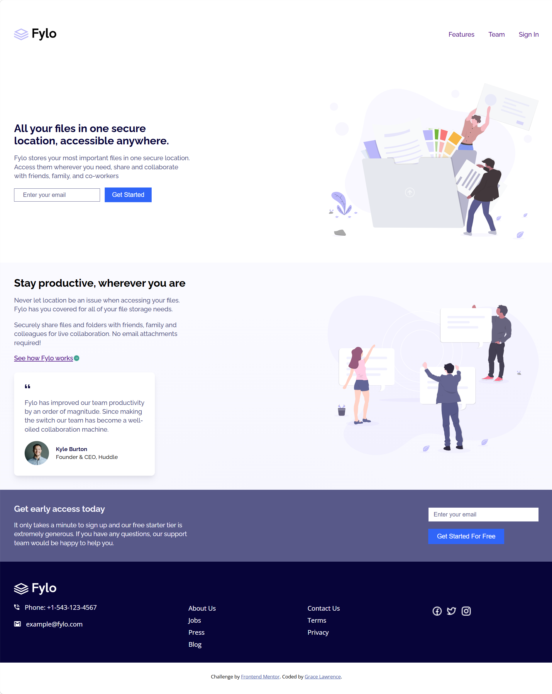

# Frontend Mentor - Fylo landing page with two column layout solution

This is a solution to the [Fylo landing page with two column layout challenge on Frontend Mentor](https://www.frontendmentor.io/challenges/fylo-landing-page-with-two-column-layout-5ca5ef041e82137ec91a50f5). Frontend Mentor challenges help you improve your coding skills by building realistic projects. 

## Table of contents

- [Overview](#overview)
  - [The challenge](#the-challenge)
  - [Screenshot](#screenshot)
  - [Links](#links)
- [My process](#my-process)
  - [Built with](#built-with)
  - [What I learned](#what-i-learned)
  - [Continued development](#continued-development)
  - [Useful resources](#useful-resources)
- [Author](#author)

## Overview

### The challenge

Users should be able to:

- View the optimal layout for the site depending on their device's screen size
- See hover states for all interactive elements on the page

### Screenshot



### Links

- Live Site URL: [Live Site](https://frontend-mentor-fylo-landing-page-weld.vercel.app/)

## My process

### Built with

- Semantic HTML5 markup
- CSS custom properties
- Flexbox
- Desktop-first workflow

### What I learned

I learned about turn the color of an image or icon to white using the filter CSS property.

```css
.call-to-action .fylo-logo {
  filter: brightness(0) invert(1);

}
```

### Continued development

I still want to continue my development on flexbox and its properties, especially on how justify and align affect the main- and cross-axis of flex-direction in row and column.

### Useful resources

- [MDN article on filter](https://developer.mozilla.org/en-US/docs/Web/CSS/Reference/Properties/filter) - This helped me to change the color of the logo image in fylo-footer and the social icons.

## Author

- Frontend Mentor - [@graycelaw](https://www.frontendmentor.io/profile/graycelaw)
- Twitter - [@graycelaw_](https://www.twitter.com/graycelaw_)